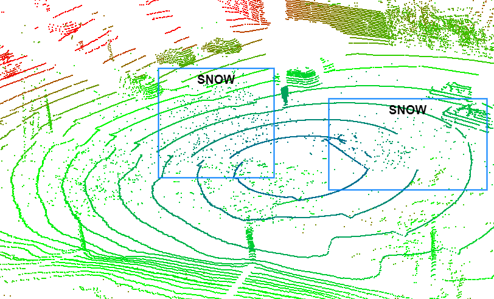
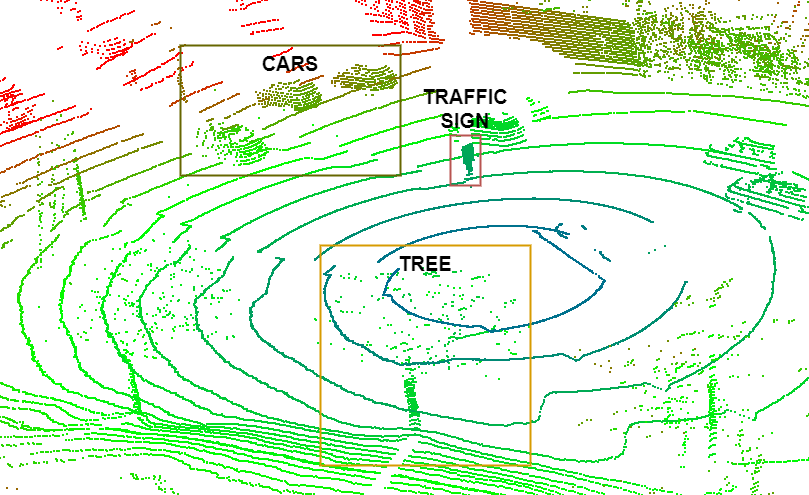

# ALFA Extensions

<p align="justify"> This repository provides ready-to-use extensions already tested with ALFA. They can be used as a starting point for developing new ones or for testing the different ALFA setups. </p>

## Table of Contents

- [ALFA Extensions](#alfa-extensions)
  - [Table of Contents](#table-of-contents)
  - [Available extensions](#available-extensions)
  - [Package and Compile ALFA Software extensions](#package-and-compile-alfa-software-extensions)
    - [Desktop](#desktop)
    - [Embedded](#embedded)
  - [Package ALFA hardware extensions](#package-alfa-hardware-extensions)
  - [Create a ALFA project, add the extension and generate the bitstream](#create-a-alfa-project-add-the-extension-and-generate-the-bitstream)
  - [Run ALFA extensions](#run-alfa-extensions)
    - [ALFA-Monitor](#alfa-monitor)
    - [RVIZ](#rviz)
    - [Node Topics and Services](#node-topics-and-services)

## Available extensions

- **Dummy** [[Software]](https://github.com/alfa-project/alfa-extensions/tree/main/sw/ext_dummy) [[Hardware]](https://github.com/alfa-project/alfa-extensions/tree/main/hw/ext_dummy) - This extension is used to demonstrate how ALFA extensions are built and used. It simply subscribes a /Pointcloud2 topic and outputs the same pointcloud into /dummy_pointcould topic.
- **Distance Filter** [[Software]](https://github.com/alfa-project/alfa-extensions/tree/main/sw/ext_distance_filter) [[Hardware]](https://github.com/alfa-project/alfa-extensions/tree/main/hw/ext_distance_filter) - This extension subscribes a /Pointcloud2 topic called /velodyne_points and outputs the processed point cloud in the /distance_filter topic.  The processing of this point cloud basically consists of a distance filter where the points within a predefined range (min and max) are displayed. By default these parameters are min_distance=5m and max_distance=20m. This node also publishes some important info regarding the processing of the point cloud, such as the time (ms) it takes to process (full node and just the handler) one point cloud frame.

- **DIOR** [[Software]](https://github.com/alfa-project/alfa-extensions/tree/main/sw/ext_dior) [[Hardware]](https://github.com/alfa-project/alfa-extensions/tree/main/hw/ext_dior) - **TODO Write a brief description of this extension**.

<!-- a normal html comment 
<p align="center">

</p>
<p align="center">(a) Point Cloud Corrupted by snow.</p>

<p align="center">

</p>
<p align="center">(b) Point Cloud after being processed with the Denoising Extension.</p>
-->

## Package and Compile ALFA Software extensions

<p align="justify">ALFA software extensions are pieces of software writting in C/C++ with ROS and ALFA-node dependencies. Therefore, to compile them CMAKE is used. Despite sharing the same source file, compiling ALFA extension for desktop and embedded use different tools and flow. In the following steps, we will show you how to package ALFA extensions for both enviroments, using as test case our basic dummy extension.

### Desktop

To compile and run the dummy extension build the packages with colcon inside the ros2 workspace (make sure that packages alfa_node, alfa_msg and ext_dummy are inside your src folder):

```sh
cd ~/ros2_ws 
colcon build 
```

The following output should appear:

```sh
Starting >>> alfa_msg
Finished <<< alfa_msg [0.52s]                     
Starting >>> alfa_node
Finished <<< alfa_node [0.18s]                
Starting >>> ext_dummy   
Finished <<< ext_dummy [0.16s]                     

Summary: 3 packages finished [1.02s]
```
Source the workspace environment to run the dummy node:

```sh
source ./install/setup.bash 
```

### Embedded

To include the extensions in the embedded image, a recipe file must be created for each extension. You can see the already existing recipes (.bb files) in the meta-alfa/recipes-alfa/alfa-extensions folder. In this case, we already provide a recipe file for the dummy extension that can be used as starting point for your new extensions.

Update ros-petalinux.bb receipe inside folder "/project-spec/meta-user/recipes-image/images" with the desired alfa extensions under 'IMAGE_INSTALL:append':

```sh
 ext-dummy \
```

Then go to your project folder and rerun the following command to update the image:

```sh
petalinux-build -c ros-petalinux
```

Create the SD Card image with the wic command:

```sh
petalinux-package --wic
```

And finally, copy the image to the SD Card:

```sh
sudo dd if=petalinux-sdimage.wic of=/dev/sda conv=fsync bs=8M
```

## Package ALFA hardware extensions

In order to create and maintain the best environment for your extensions, we advise the usage of the package IP tool provided by Vivado. In the following steps , we will show you how to package ALFA hardware extensions, using as test case our basic dummy extension. Note that this following steps are only to expose the package process. If you want to test any extention already provided by ALFA, you can jump to [Create a ALFA project, add the extension and generate the bitstream](#create-a-alfa-project-add-the-extension-and-generate-the-bitstream). Inside Xilinx's Vivado:

1) Go to the <b>Tools</b> menu and select the <b>Create and Package New IP...</b> </p>

<p align="center">

</p>

2) After pressing <b>Next</b> in the first menu, select the option "Package a specified directory" in the Package Options section. Then pres <b>Next</b>.

3) Select the dummy extension directory (directory containing all the hardware files -> PATH_TO_ALFA_FRAMEWORK/alfa-extensions/hw/ext_dummy/) and press *Next*.

4) Then, change the *Project name* field to "dummy_extension" and let the Project location be the default path for your Vivado projects.

5) Finishing the process by clicking *Finish*. A new Vivado window will pop-up with your dummy extension package on it.

6) In order to take full advantage of Vivado Block Design features, we need to identify the ALFA interfaces present in the dummy. Select the menu *Port and Interfaces* of the Package IP and select the menu *Auto infer interface*:

<p align="center">

</p>

7) Select User&rarr;Cartesian_representation_rtl and press *OK*. (Note: if none of ALFA interfaces are shown in the menu, the ALFA interfaces are not present in the IP catalog. For more information, check the [ALFA-Unit Integration section](https://github.com/alfa-project/alfa-unit#integration)

<p align="center">

</p>

8) Repeat the process for the User&rarr;Extension_Interface_rtl.

9) The *Ports and interfaces* menu should look like this:

<p align="center">

</p>

10) Associate the clock signal for both interfaces by right clicking on top of them and selecting associate clock. Then select the *i_SYSTEM_clk* checkbox and press *OK*.

<p align="center">

</p>

11) Select the *Review and Package* submenu and press the *Package IP* button to finalize the process of packaging the ALFA extension:

<p align="center">

</p>

## Create a ALFA project, add the extension and generate the bitstream
ALFA projects can be created using the an TCL script that setups all components and the required configurations. To run this script, go to main folder of the alfa-unit repository, make the script *setup_vivado_project* executable if is not already and run it with the name of the project that you want as argument:

```sh
cd PATH_TO_ALFA_FRAMEWORK/alfa-unit
chmod +x setup_vivado_project
./setup_vivado_project <project_name>
```

The script will open the Vivado GUI and create a new project with the name provided as argument (the project will be created in the folder *PATH_TO_ALFA_FRAMEWORK/alfa-unit/projects/<project_name>*). Then, it will add the ALFA unit and ZCU104 SoC to the design.

Add the extension to the block design and connect all the remaining unconnected interfaces. Note that only the native extensions will appear automatically in the IP catalog. Your extensions IP must be included in this project IP catalog to make them available in block design. 

Please adjust the number of Debug Points and User Define interfaces required for your extension. Finally, create a wrapper for the design and proceed to generate the bitstream. 

*Note* Do not forget to add the generated bitstream into the final image with the command:

```sh
petalinux-package --boot --fpga <PATH_TO_YOUR_BITSTREAM>/<BITSTREAM_FILE_NAME>.bit --u-boot --force
```
## Run ALFA extensions

To run the dummy node execute the following command. By default the subscriber topic is /velodine_points, but you can specify a different one when starting the node:

```sh
ros2 run ext_dummy ext_dummy /<topic-name>
```

The following output should appear for a software only extension:

```sh
--------------------------------------------------------
Starting ALFA node with the following settings: 
Subscriber topic: /velodyne_points
Name of the node: ext_dummy
Extension ID: 0
Pointcloud ID: 0
Hardware Driver (SIU): false
Hardware Extension: false
--------------------------------------------------------
```

or this if hardware is enable:

```sh
Hardware Extension: true
```

The node is now ready to process pointcloud data. The point clouds used by ALFA can either come from the physical sensor connected to a Ethernet interface or from a ROS2 bag file with a previous sensor capture in a real world scenario. To read it from a Ros Bag the recommended datasets are the following:

- [Semantic KITTI](http://www.semantic-kitti.org/dataset.html#download) (For the following extensions: [ext-dummy](https://github.com/alfa-project/alfa-extensions/tree/main/sw/ext_dummy),
- [UMA-SAR](https://www.uma.es/robotics-and-mechatronics/cms/menu/robotica-y-mecatronica/datasets/)
- [Lincoln MKZ Dataset by Richard Kelley](https://richardkelley.io/data) (For the following extensions: [ext-dior](https://github.com/alfa-project/alfa-extensions/tree/main/sw/ext_dummy))

**Note:** Semantic KITTI datasets are not in the ROS2 bag format, so you have to convert them first. Instructions here: <https://github.com/tomas789/kitti2bag> or <https://github.com/amslabtech/semantickitti2bag>. However this converts only for the ROS1 format. You have to convert it again for ROS2.

ALFA supports the following two methods to play bags and visualize data.

### ALFA-Monitor

Open a new terminal and go to your ROS2 workspace. Source the enviroment again:

```sh
source ./install/setup.bash 
```

And then launch the alfa-monitor:

```sh
ros2 run alfa-monitor alfa-monitor
```

To get further details on how to use the tool go to the ALFA-Monitor [repository](https://github.com/alfa-project/extensions).

### RVIZ

Go to the your bag dir and play it the following command. In this case we use the bag alread included in the alfa-monitor repository (we unzip it first):

```sh
ros2 bag play alfa-monitor/bags/semantickitti_seq00_sample_HDL-64.db3 --loop
```

The terminal where the ext_dummy is running should output:

```sh
Point cloud received
```

Before using the rviz2 tool, provided by ROS2, to vizualize the point could ouputs we need to apply a window transform for the output of ALFA dummy node and the bag point cloud:

```sh
ros2 run tf2_ros static_transform_publisher "0" "0" "0" "0" "0" "0" "map" "dummy_pointcloud" 
```

```sh
ros2 run tf2_ros static_transform_publisher "0" "0" "0" "0" "0" "0" "map" "velodyne" 
```

```sh
ros2 run rviz2 rviz2
```

Now the RViz window should appear:

- Add a new vizualization
- Add by topic
- add both /velodyne_points (to see the original) and /dummy_pointcloud (to see the point cloud processed by the ALFA dummy node).

### Node Topics and Services

To check topics:

```sh
ros2 topic list
```

Will outut:

```sh
/ext_dummy_alive
/ext_dummy_metrics
/ext_dummy_pointcloud
```

Echo the topics to output what their are posting:

```sh
ros2 topic echo /ext_dummy_alive 
node_name: ext_dummy
node_type: extension
config_service_name: ext_dummy_settings
current_status: 0
config_tag: Configuration
default_configurations:
- config_name: min_distance
  config: 5.0
- config_name: max_distance
  config: 20.0
```

```sh
ros2 topic echo /ext_dummy_metrics 
message_tag: ''
metrics:
- metric_name: Handler processing time
  metric: 44.0
  units: ms
- metric_name: Full processing time
  metric: 60.0
  units: ms
```

To check the services provided by the ALFA dummy:

```sh
ros2 service list
```

Set parameters will change the two available parameters to change, which are **min_distance** and **max_distance**, e.g., to change the min distance to 1.0, type:

```sh
ros2 param set /ext_dummy min_distance 1.0
```

Change these parameters to see the output changing in the RViz tool.
